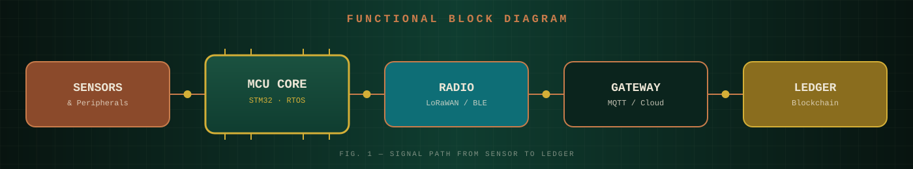

`PART NO. LORAWAN-LBM-01` &nbsp;·&nbsp; `REV. 2026.08` &nbsp;·&nbsp; `FIRMWARE MODULE`

 

> ⚠️ **IMPORTANT NOTICE:** The source code for this repository is currently restricted.   **You must submit a request to gain access to the repository codes.** See `Section 05` for details.

|  |  |  |
|:--:|:--:|:--:|
| `01` General Description | `02` Key Features | `03` Tech Stack & Hardware |
| `04` Architecture Diagram | `05` Code Access Request | `06` Support & Contact |

 

## `01` 📋 General Description

This repository contains the implementation, porting, and integration of the **LoRaWAN stack** utilizing the **Semtech LoRa Basics™ Modem (LBM)** tailored for the **STM32CubeWL** microcontroller family. 

Designed for low-power IoT applications, this firmware architecture bridges the gap between Semtech's advanced modem features and STMicroelectronics' robust sub-GHz hardware, providing a stable, production-ready foundation for LoRaWAN end-nodes.

| Specification | Value |
|:--|:--|
| **Core Technology** | LoRaWAN / LoRa Basics Modem (LBM) |
| **Target Hardware** | STMicroelectronics STM32WL Series |
| **Development Env** | STM32CubeIDE / Makefile / CMake |
| **Optimization** | Ultra-Low Power (ULP) & Memory Constrained |
| **Status** | Active Development / Controlled Access |

## `02` ✨ Key Features

- **Seamless LBM Integration:** Full integration of Semtech's LoRa Basics Modem v4.x/v3.x into the STM32CubeWL ecosystem.
- **Hardware Abstraction Layer:** Highly optimized HAL integration for radio control (Sub-GHz PHY).
- **Advanced Low-Power Modes:** Proper handling of STM32WL STOP2 and Standby modes in conjunction with LBM sleep cycles.
- **LoRaWAN Class Support:** Ready for Class A, Class B, and Class C device profiles.
- **Event-Driven Architecture:** Minimal CPU wake-up times utilizing hardware RTC and interrupt lines.

## `03` ⚙️ Tech Stack & Hardware

## `04` 🔗 Architecture Diagram

 
<i>System Block Diagram outlining the interaction between STM32 HW, Sub-GHz Radio, and LBM Stack.</i>

## `05` 🔒 Code Access Request

Due to the nature of this project and potential proprietary integrations, **the source code is not openly available to the public.** 

If you are a researcher, collaborator, or an organization interested in reviewing or using this integration, you must request access.

### 📝 How to request access:
1. Send an email to my contact address provided below.
2. Include `[Code Access Request] LoRaWAN-LBM-CubeWL` in the subject line.
3. Briefly introduce yourself or your organization and the intended use case for this codebase.
4. Provide your GitHub username so I can grant repository permissions upon approval.

## `06` 📦 Support & Contact Information

 

  <i>Engineered for Reliability. Built for IoT. 📡</i>
   
  <i>Part of the Behrad-bs Embedded Ecosystem.</i>

